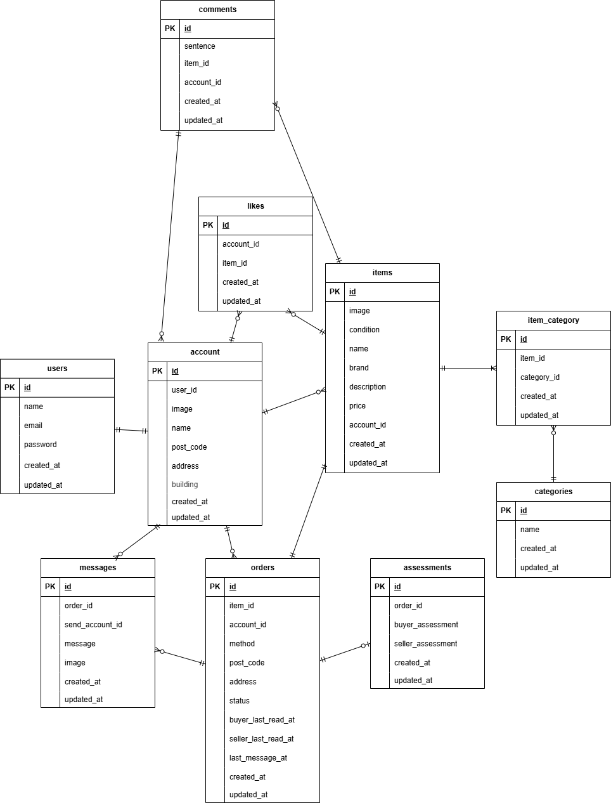

# flea_market

## 環境構築

Dockerビルド
1. git clone https://github.com/tsugumi-0406/pro_test_flea_market 
2. cd flea_market 
2. docker-compose up -d --build

Laravel 環境構築
1. docker-compose exec php bash
2. composer install
3. .env.example ファイルから.envを作成する
4. php artisan key:generate
5. php artisan migrate
6. php artisan db:seed
7. php artisan storage:link
8. exit
9. docker-compose exec mysql mysql -uroot -p
10. root
11. CREATE DATABASE demo_test;

 
## URL
・開発環境 : http://localhost/ 
・ユーザー登録 : http://localhost/register 
・phpMyAdmin : http://localhost:8080/  
・メール認証 : http://localhost:8025/

## 使用技術
・PHP 8.1 
・Laravel 8.83.29 
・MySQL 8.0.26 
・nginx:1.21.1

## その他
環境変数を変更した場合（APP_URL 等）は、以下を実行してください。 
php artisan config:clear 
php artisan cache:clear 

登録されているユーザーの情報 
ユーザー名 : テスト1 
メールアドレス：aaa@gmail.com 
パスワード：password1 
CO01～CO05を出品している 

ユーザー名 : テスト2 
メールアドレス：bbb@gmail.com 
パスワード：password2 
CO06～CO010を出品している 

ユーザー名 : テスト3 
メールアドレス：ccc@gmail.com 
パスワード：password3 

db:seedで作成されます。

## ER図

# pro_test_flea_market
